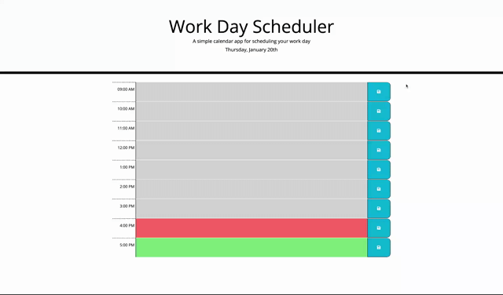

# Work-day-scheduler

## Functionality
* Helps to create a schedule
* Current Date is displayed at the top of the calendar
* Timeblocks are displayed for this day, each timeblock is color coded to indicate whether it is in the past(grey), present(red) or future(green)
* An event can be added in each timeblock
* When save button is clicked, the text for that event is saved in the local storage.
* When I refresh the page, the saved events persist.

## Links
https://github.com/NadineMohsen/Work-day-scheduler
https://nadinemohsen.github.io/Work-day-scheduler/

## Demo 

